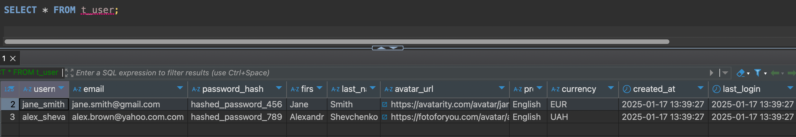

### Hillel Java Pro project
***
### Homework 27.1  Working with the database
***
A small description of the pet project:
__WiseTripWallet__ - is a web application for travel planning, budget management and expense tracking while traveling. The application helps users not only organize their travels, but also effectively control their expenses, optimize their budget and avoid unnecessary financial overpayments.__
* Created database for project:

* Created tables:   
  * t_user: User information (name, email, password, settings).
  * t_trip: Trip data (name, dates, budget).
  * t_category: Expense categories for each trip.
  * t_budget: Planned and actual budget by category.
  * t_currency: System currencies (symbols, names).
  * t_expense: User expenses (amount, description, date, currency).
  * t_trip_currency: Currencies and exchange rates for trips.
  * t_tag: Tags for expenses (color, owner).
  * t_tag_expense: Link between tags and expenses

Inserted test data to tables:

Showing all users:

Deleted user with username: 'john_doe'

Showing all users without user 'John Doe':

