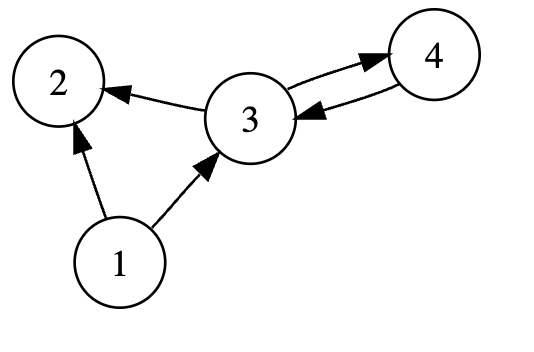

### Hillel Java Pro project
***
### Homework 20.1 Work with graphs
***
__Implemented the functional of creating graphs and performing basic operations on them:__
* Adding a graph vertex.
* Adding an edge between two vertices.
* Removing a vertex from the graph.
* Removing an edge between two vertices.
* Checking if a vertex exists in the graph.
* Check if an edge exists between two vertices in the graph.
* 
__Diogram of the graph:__

