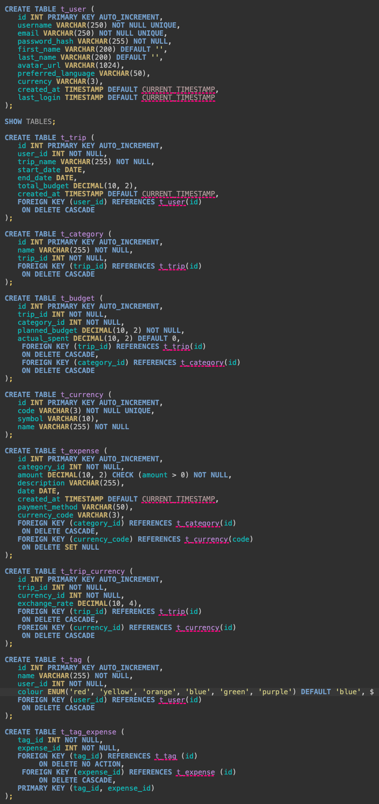
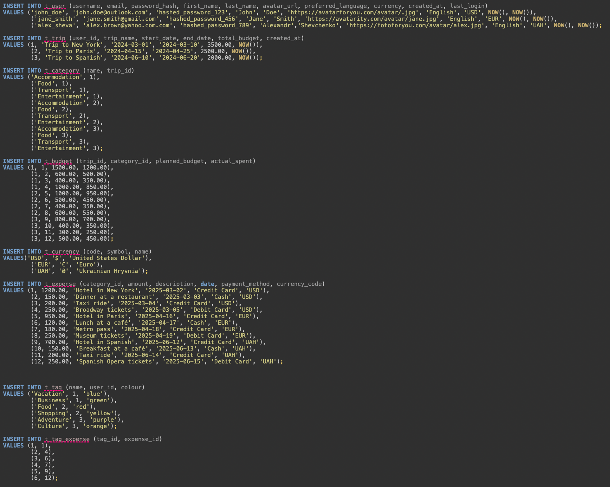
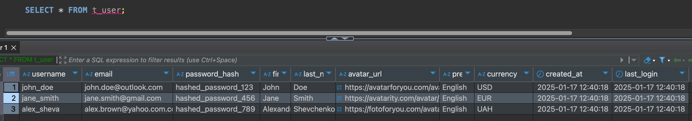
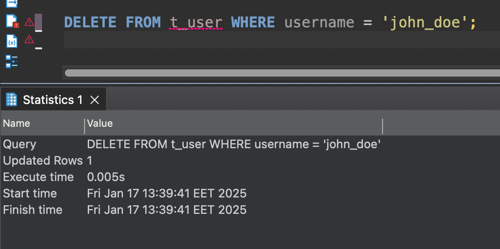

### Hillel Java Pro project
***
### Homework 28.1 Working with the database: Aggregate functions
***
__Creating database for project:__

__Creating tables:__

__Inserting test data to tables:__

__Limit selection (LIMIT):__

__Calculating the total amount of expenses per user (SUM), calculating the average amount of expenses per user, and grouping data (GROUP BY):__

